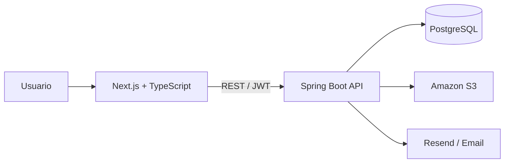

<p align="center">
  
</p>

<h1 align="center">ReTrueque</h1>

<p align="center">
  Plataforma colaborativa para publicar servicios, solicitar intercambios y gestionar acuerdos entre usuarios.
</p>

<p align="center">
  <a href="https://retrueque.cambers.lat"><strong>Demo</strong></a>
  ·
  <a href="https://api.retrueque.cambers.lat/swagger-ui/index.html"><strong>Swagger</strong></a>
  ·
  <a href="https://cambers.lat"><strong>Portafolio</strong></a>
  ·
  <a href="https://github.com/No-Country-simulation/s17-11-n-java-next"><strong>Proyecto original</strong></a>
</p>

<p align="center">
  
  
  
  
  
  <a href="https://github.com/EdgarCamberos1894/ReTrueque/actions/workflows/ci.yml">
    
  </a>
</p>

---

## Sobre el proyecto

ReTrueque es una plataforma de intercambio de servicios entre personas. Permite publicar servicios, descubrir ofertas de otros usuarios, enviar solicitudes de intercambio, aceptar o rechazar solicitudes y registrar comentarios y calificaciones después de un acuerdo.

El proyecto nació como parte de una simulación colaborativa de **No Country**, desarrollada por un equipo multidisciplinario. Este repositorio es mi fork personal y conserva tanto el trabajo realizado durante la simulación como ajustes posteriores para convertirlo en una demo de portafolio más clara y mantenible.

> **Rama canónica:** `main` contiene actualmente frontend y backend dentro del mismo repositorio.

## Mi aporte

Mi trabajo se concentró principalmente en el backend y en la integración de funcionalidades que atravesaban distintas partes del sistema:

- Diseño de endpoints y reglas de negocio con Java y Spring Boot.
- Autenticación con JWT y controles de autorización.
- Flujo de solicitudes de intercambio, aceptación y rechazo.
- Verificación de cuentas mediante tokens y correo electrónico.
- Emails transaccionales.
- Integración con Amazon S3 para imágenes.
- DTOs, mappers y separación por capas.
- Migraciones de base de datos con Flyway.
- Documentación de la API con OpenAPI / Swagger.
- Mantenimiento posterior del fork, ajustes para demo y consolidación del monorepo.

La intención de conservar este proyecto en mi portafolio no es presentarlo como mi arquitectura más avanzada, sino mostrar un punto importante de mi evolución: pasar de pensar únicamente en que una funcionalidad funcionara a considerar también revisión, mantenibilidad, autorización, pruebas y separación de responsabilidades.

## Arquitectura



La aplicación se mantiene como un monorepo con dos componentes principales:

```text
ReTrueque/
├── frontend/     # Aplicación web con Next.js
├── retrueque/    # API REST con Java y Spring Boot
├── .github/      # CI y plantillas de colaboración
└── README.md
```

## Stack tecnológico

| Área | Tecnologías |
| --- | --- |
| Backend | Java 17, Spring Boot 3.3, Spring Security, Spring Data JPA |
| Seguridad | JWT, autorización por usuario y propiedad del recurso |
| Base de datos | PostgreSQL, Flyway |
| Frontend | Next.js 14, React 18, TypeScript, Tailwind CSS |
| Estado y datos | TanStack Query, Zustand |
| Formularios | React Hook Form, Zod |
| Archivos | Amazon S3 |
| Email | Resend, Thymeleaf |
| API | REST, OpenAPI / Swagger |
| Infraestructura | Docker, Vercel, despliegue backend independiente |
| Calidad | GitHub Actions para build de frontend y validación del backend |

## Funcionalidades destacadas

- Registro, autenticación y verificación de cuentas por correo.
- Publicación, edición y eliminación de servicios.
- Control de propiedad para operaciones sensibles.
- Búsqueda paginada y filtros por categoría, provincia y departamento.
- Solicitudes entre usuarios.
- Aceptación o rechazo por parte del dueño del servicio.
- Comentarios y calificaciones después de una solicitud aceptada.
- Subida de imágenes a Amazon S3.
- Documentación interactiva mediante Swagger UI.

## Probar la demo

Las dos cuentas demo existen para poder observar el flujo desde ambos lados de una interacción. **No representan roles de autorización diferentes.**

| Cuenta | Uso sugerido | Credenciales |
| --- | --- | --- |
| John | Explorar servicios y generar solicitudes | `john_doe@example.com` |
| Jane | Revisar la experiencia desde el otro lado del intercambio | `jane_smith@example.com` |

**Contraseña para ambas:** `Demo123!`

Puedes comenzar explorando la aplicación con John y después entrar con Jane para revisar cómo cambia la experiencia cuando la interacción pertenece al otro usuario.

### Accesos rápidos

- Aplicación: https://retrueque.cambers.lat
- Swagger UI: https://api.retrueque.cambers.lat/swagger-ui/index.html
- Portafolio: https://cambers.lat

## Decisiones técnicas

Algunas decisiones que ayudan a entender el proyecto actual:

- **DTOs en la API:** las entidades de persistencia no se utilizan directamente como contrato externo.
- **Flyway como fuente de verdad del esquema:** las migraciones versionan los cambios de base de datos y producción utiliza validación del esquema.
- **Autorización por propiedad:** editar o eliminar un recurso requiere validar que pertenece al usuario autenticado.
- **Integraciones aisladas mediante servicios:** almacenamiento y correo se mantienen fuera de los controladores.
- **Configuración por entorno:** URLs, credenciales y secretos se inyectan mediante variables de entorno.
- **Frontend y backend en `main`:** los despliegues pueden consumir la misma rama usando directorios raíz distintos.

## Ejecutar localmente

### Frontend

```bash
cd frontend
cp .env.example .env.local
npm install
npm run dev
```

Por defecto queda disponible en `http://localhost:3000`.

Variables principales:

```env
NEXT_PUBLIC_BACKEND_URL=http://localhost:8080
NEXT_PUBLIC_API_URL=http://localhost:3000
```

### Backend

Requisitos principales:

- Java 17
- PostgreSQL
- Variables de entorno configuradas a partir de `retrueque/.env.example`

En PowerShell:

```powershell
cd retrueque
Copy-Item .env.example .env
$env:SPRING_PROFILES_ACTIVE="dev"
.\mvnw.cmd spring-boot:run
```

Flyway crea y versiona el esquema de base de datos. Con la aplicación en ejecución, Swagger UI queda disponible en:

`http://localhost:8080/swagger-ui/index.html`

## Rutas principales de la API

```text
POST                 /api/v1/auth/register
POST                 /api/v1/auth/login
GET|POST|PUT|DELETE  /api/v1/service
GET|POST|PUT         /api/v1/requests
```

## Despliegue

La estructura del repositorio permite desplegar ambos componentes desde `main`:

| Componente | Rama | Directorio raíz |
| --- | --- | --- |
| Frontend | `main` | `frontend` |
| Backend | `main` | `retrueque` |

Las variables de entorno se configuran en cada plataforma y no deben versionarse en el repositorio.

## Origen y trazabilidad

ReTrueque fue desarrollado originalmente como un proyecto colaborativo de No Country. Este fork conserva esa procedencia y enlaza explícitamente al repositorio del equipo para mantener clara la atribución del trabajo.

- **Repositorio original:** https://github.com/No-Country-simulation/s17-11-n-java-next
- **Fork personal:** https://github.com/EdgarCamberos1894/ReTrueque

---

<p align="center">
  Proyecto conservado como evidencia técnica y como registro de mi evolución en desarrollo backend.
</p>
